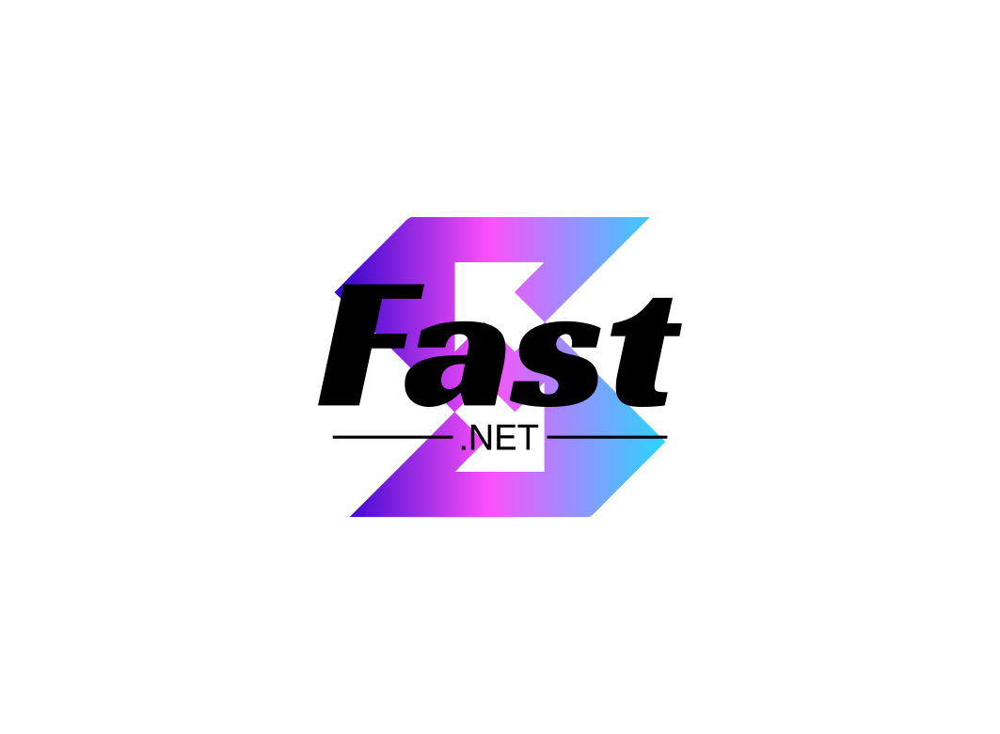

<p align="left">
	<a href="./README.zh.md">简体中文</a> | <strong>English</strong>
</p>

<p align="center">
	
</p>

# @fast-element-plus/icons-vue

Tree-shakable SVG icon components for Vue 3 applications.

[](https://www.npmjs.com/package/@fast-element-plus/icons-vue) [](https://nodejs.org/) [](https://vuejs.org/) [](./LICENSE)

## Highlights

- 68 typed Vue 3 components generated deterministically from repository-owned SVG files.
- One ESM named-export entry with preserved icon module boundaries for Tree Shaking.
- Vue fallthrough attributes reach each root `<svg>`, so size, class, style, ARIA attributes and event listeners remain under application control.
- A separately minified IIFE build for unpkg and jsDelivr, with Vue supplied by the page.
- TypeScript 6 strict checks, generated-source drift checks, ESLint, runtime tests, consumer type tests, package validation and Publint.

## Install

```bash
pnpm add @fast-element-plus/icons-vue
```

Vue `^3.3.0` is required as a peer dependency.

## Use individual icons

```vue
<script setup lang="ts">
import { About, Dashboard, Page404 } from "@fast-element-plus/icons-vue";
</script>

<template>
	<About class="app-icon" aria-label="About" role="img" />
	<Dashboard class="app-icon" aria-hidden="true" />
	<Page404 class="empty-state" aria-label="Page not found" role="img" />
</template>

<style scoped>
.app-icon {
	width: 1em;
	height: 1em;
	fill: currentColor;
}

.empty-state {
	width: 20rem;
	height: auto;
}
</style>
```

Most single-color icons can follow text color through `fill: currentColor`. Authored fills in multicolor illustrations such as `Page403` and `Page404` take precedence on their child elements.

Decorative icons should use `aria-hidden="true"`. Meaningful standalone icons should receive an accessible name, normally through `aria-label` and `role="img"`.

## Register every icon globally

Applications that intentionally accept the larger initial module graph can register all exports:

```ts
import * as FastElementPlusIconsVue from "@fast-element-plus/icons-vue";
import { createApp } from "vue";
import App from "./App.vue";

const app = createApp(App);

for (const [name, component] of Object.entries(FastElementPlusIconsVue)) {
	app.component(name, component);
}

app.mount("#app");
```

Prefer individual named imports for application code so bundlers can remove unused icons.

## CDN

The `unpkg` and `jsdelivr` fields select `dist/index.global.min.js`. Load Vue first; the icon bundle exposes `FastElementPlusIconsVue`.

Pin exact package versions and configure CSP/SRI when the deployment requires supply-chain controls.

## Public API

The package root exposes one named Vue component per SVG file. Component-name casing is part of the public API, including `Api`, `Gps`, `IdCard`, `FullScreen`, `Page403` and `Page404`. There is no default package export and no supported icon subpath API.

See the [API reference](./docs/API.md) for the complete component catalog and behavioral contract.

## Generated sources

Files under `src/icons/` and `src/index.ts` are generated from `icons/*.svg` and are committed so public API changes remain reviewable.

```bash
pnpm generate
pnpm generate:check
```

Edit the SVG source, run `pnpm generate`, and review both the SVG and generated TSX diff. Do not hand-edit generated icon modules.

## Runtime and package contract

- Package-manager consumers receive pure ESM targeting ES2022.
- Vue remains external and is resolved from the consuming application.
- Every component renders one root `<svg>` with its authored `viewBox`.
- The repository root is the only npm package; `pnpm build` writes only to the ignored root `dist/` directory.
- The package does not publish CommonJS or public icon subpath exports.

See the [runtime contract](./docs/RUNTIME_CONTRACT.md) for details.

## Documentation

- [API reference](./docs/API.md)
- [API reference (Chinese)](./docs/API.zh-CN.md)
- [Runtime contract](./docs/RUNTIME_CONTRACT.md)
- [Development and release guide (Chinese)](./docs/DEVELOPMENT_RELEASE.zh-CN.md)
- [Contributing guide](./CONTRIBUTING.md)
- [Security policy](./SECURITY.md)
- [Changelog](./CHANGELOG.md)

## Development

Development requires Node.js `^22.18.0 || ^24.18.0` and pnpm `^11.0.0`.

```bash
pnpm install --frozen-lockfile
pnpm check
```

Use `pnpm dev` for a long-running tsdown watch build. Run `pnpm generate` first whenever an SVG source changes.

## License

[Apache-2.0](./LICENSE)
